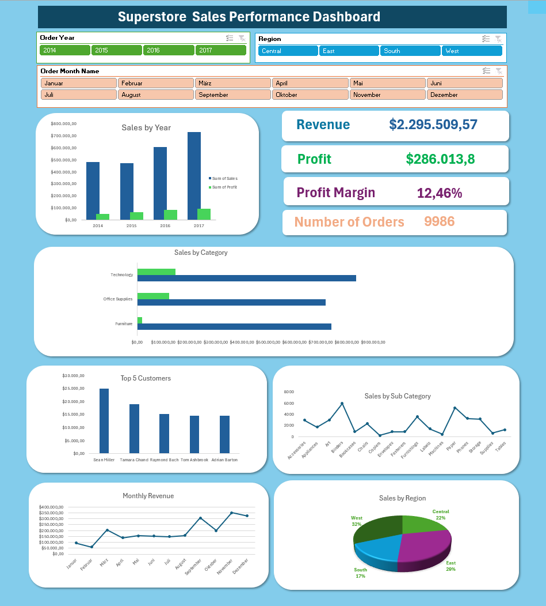

# Superstore Sales Performance Dashboard (Excel)

## Project Overview
This project analyzes retail sales performance using the Superstore dataset.  
The objective was to transform raw transactional data into actionable business insights and build an interactive Excel dashboard.

The dashboard allows users to explore revenue, profitability, customer performance, and seasonal trends through interactive filters.

Additional exploratory analyses were conducted using pivot tables to investigate revenue drivers, profitability differences, and product mix effects. Only the most relevant visualizations were included in the final dashboard to maintain clarity.

All financial values in this project are expressed in **USD ($)**, as the dataset represents U.S. retail transactions.

---

## Business Problem
Retail companies generate large volumes of transactional data but often struggle to extract meaningful insights.

This project aims to answer key business questions:

- How is overall sales performance evolving over time?
- Which product categories generate the most revenue and profit?
- Which regions are the most profitable?
- Who are the top customers driving revenue?
- Are there seasonal sales patterns?

---

## Data Preparation
Before analysis, the dataset required several cleaning steps:

- Corrected **data type and locale issues** during import to ensure proper interpretation of dates and decimal values.
- Removed duplicate records based on **Order ID and Product ID**
- Standardized text fields (Customer Name, Country, State, City, Segment)
- Created new time variables (Order Year, Month Name, Month Number)

---

## Key Performance Indicators

- Total Revenue: $2,295,509  
- Total Profit: $286,013  
- Profit Margin: 12.46%  
- Number of Orders: 9,986  
- Average Order Value: $229.87  

---

## Analytical Approach

Several pivot-table analyses were conducted to investigate the main performance drivers:

### Sales Trend Analysis
Examined yearly sales evolution to identify growth patterns over time.

### Product Category Analysis
Compared revenue and profit contributions across product categories.

### Regional Performance Analysis
Analyzed differences in sales and profit performances across regions.

### Customer Analysis
Identified the **Top 5 customers** contributing the highest revenue.

### Seasonality Analysis
Evaluated monthly sales patterns to detect seasonal demand trends.

## Analytical Investigation

During the exploratory analysis, a temporary decline in sales was observed between 2014 and 2015.

To understand the cause, several hypotheses were tested:

1. **Quantity Analysis**
   - Total quantity sold slightly increased from 2014 to 2015.
   - This indicated that the decline was not caused by reduced demand.

2. **Discount Analysis**
   - Average discounts remained relatively stable across the years.
   - This suggested that pricing promotions were not the main driver of the change.

3. **Average Sales per Order**
   - The average sales value decreased from approximately $242 in 2014 to $223 in 2015.

This investigation suggested that the decline was likely due to a **product mix effect**, where lower-priced products represented a larger share of total sales during that period.

---

## Key Business Insights

- Technology generates the highest revenue and profit.
- The West region shows the strongest performance.
- Sales increased significantly in 2017 compared to previous years.
- A small number of customers contribute a large share of total revenue.
- Seasonal patterns exist in monthly sales performance.

---

## Business Recommendations

Based on the analysis, several actions could help improve performance:

- **Focus on Technology products**, which generate the highest revenue (over $835K) and the strongest profitability among product categories.
- **Strengthen the West region strategy**, as it shows the highest profitability with a profit margin of **14.94%**, compared to **7.92%** in the Central region.
- **Investigate the Central region**, where profit margins are significantly lower, which may indicate higher operational costs, stronger competition, or heavier discounting.
- **Develop retention strategies for top customers**, since a small number of customers contribute a large share of total revenue.
- **Monitor product mix carefully**, since shifts toward lower-priced products can reduce overall revenue growth even when sales volume increases.

---

## Tools Used

- Microsoft Excel
- Pivot Tables
- Pivot Charts
- Data Cleaning Functions
- Interactive Slicers

---

## Dashboard Preview

---

## Files in This Repository

- **Superstore_Raw_Data.csv** -- Original dataset  
- **Superstore_Sales_Dashboard.xlsx** -- Final Excel dashboard and analysis  
- **Superstore_dashboard_preview.png** -- Dashboard screenshot preview

## Future Improvements

- Rebuild the dashboard using **Power BI**
- Perform deeper analysis using **SQL**
- Conduct advanced analysis with **Python**
